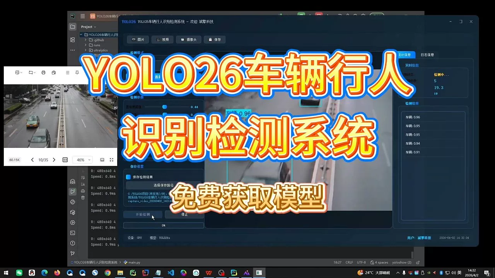
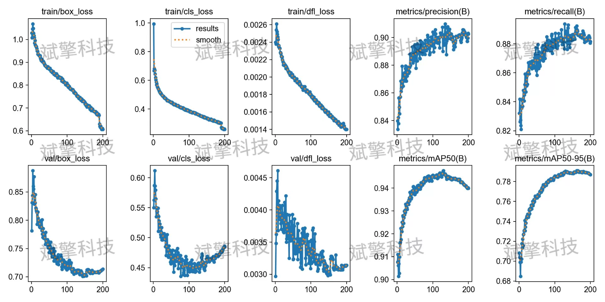
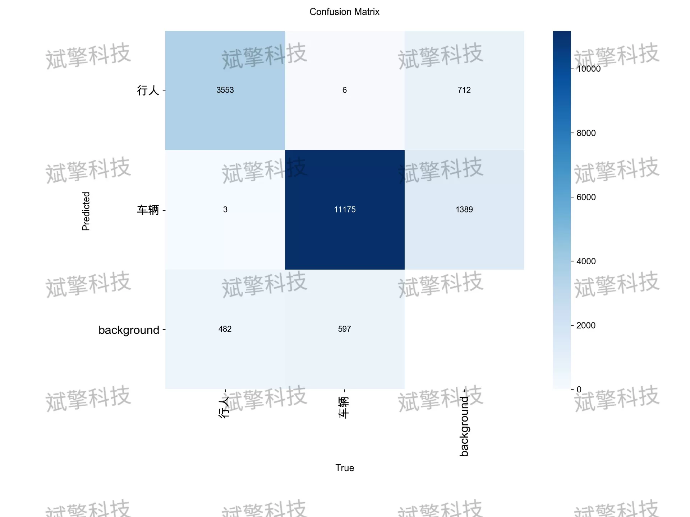
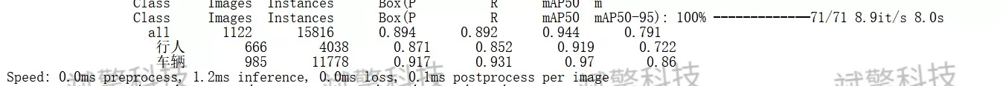
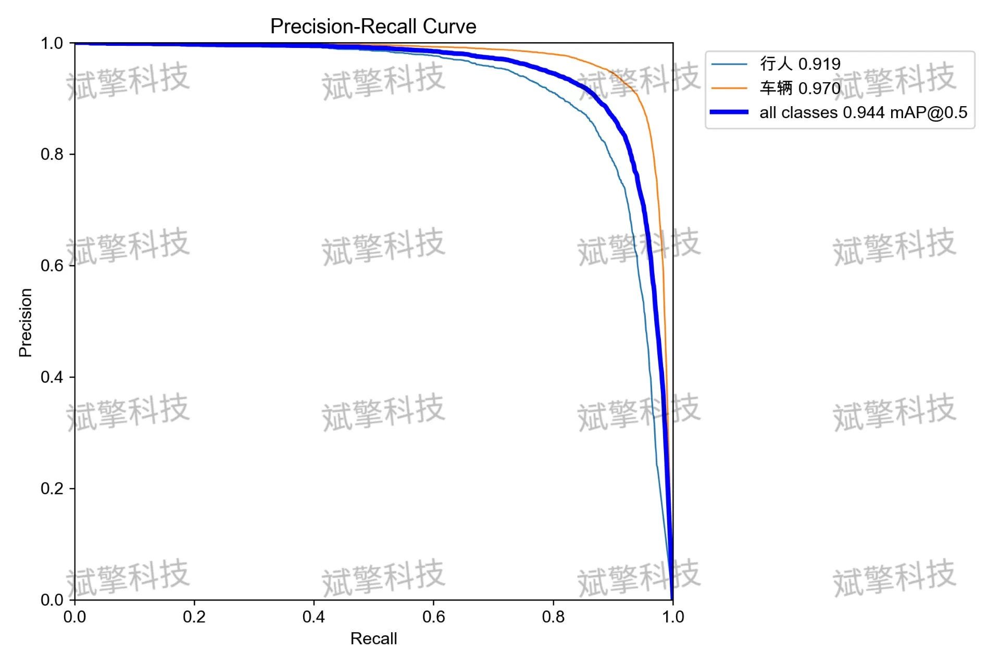
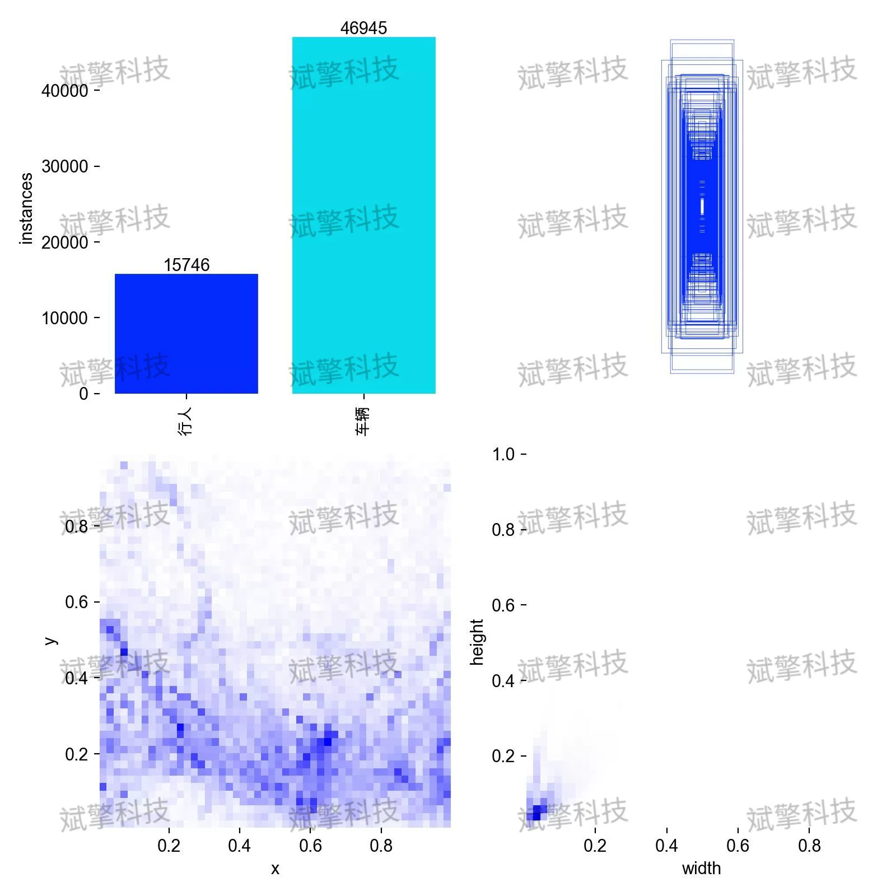
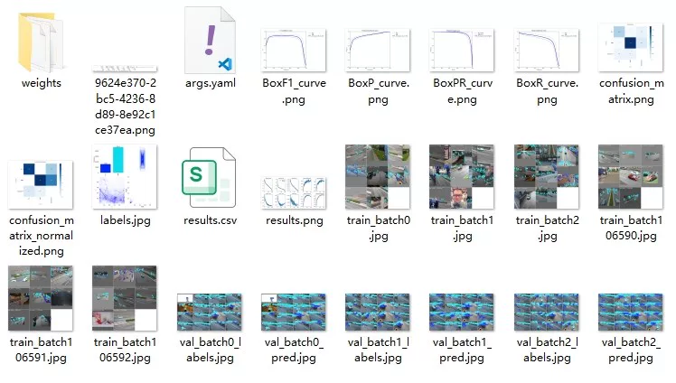
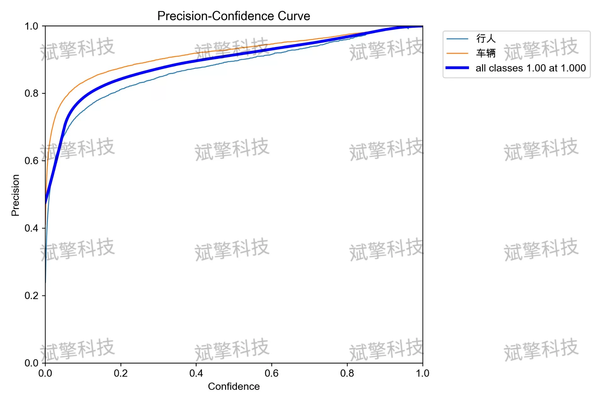
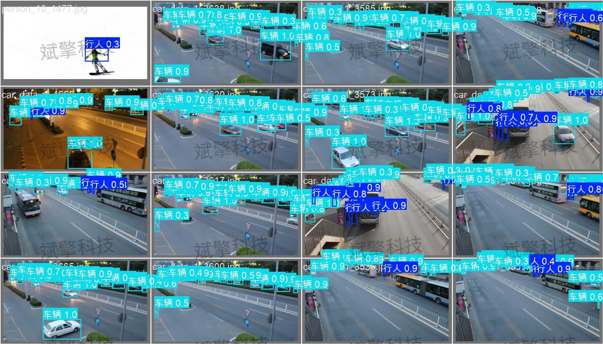

# YOLOv26 Vehicle and Pedestrian Detection System | Source Code + Model

## Body

This report is based on the YOLO26 object detection algorithm and builds and trains a vehicle and pedestrian detection system for traffic scenarios. The system adopts a dual-category detection architecture (pedestrians, vehicles), using a dataset containing 5607 labeled images for training and validation. Experimental results show that the model achieved an excellent mAP50 of 0.944 on the validation set, with vehicle detection achieving an mAP50 of 0.970 and pedestrian detection reaching 0.919. The model's inference speed is only 1.2ms per image, demonstrating real-time detection capabilities. A confusion matrix analysis indicates that there is some degree of mutual misdetection between pedestrians and vehicles, but overall performance is outstanding, meeting the deployment requirements of intelligent transportation and security monitoring scenarios.

The dataset consists of a total of 5607 images, divided into:
Training set    4485 images    for model parameter learning
Validation set    1122 images    for performance evaluation and tuning
The dataset contains a total of 15816 labeled instances, including:
Pedestrians (person): 4038 instances, distributed across 666 images
Vehicles (car): 11778 instances, distributed across 985 images

Free reservation for remote installation. Unsuccessful installation will result in a full refund.
Purchase includes the following resources (unlocked through Baidu Cloud):
YOLO recognition detection project complete source code
YOLO format datasets
Training code + UI interface code
Trained model + results images
Software installer
Add WeChat to make a reservation for remote installation (automatically displayed after purchase) — Unsuccessful, full refund guaranteed

⚙️ Core functionality modules
Detection capability
- Image detection: upload and detect, returning detection boxes + category information
- Video detection: supports video files, analyzing frames accurately one by one
- Camera real-time detection: connect USB cameras to achieve dynamic monitoring
Interaction and control
- Target selection: freely choose one or more categories for detection
- Real-time adjustment of parameters: adjustable confidence threshold & IoU threshold, flexibly controlling precision
- Results saving: one-click save of images/videos/camera detection results
System and data
- User login registration: supports password strength detection + encryption storage
- Log recording: automatically records operation and error information (timestamped)

## Images

## Payment

Here is a pay link on Stripe ( https://buy.stripe.com/3cs8yP7sY87d0vu9AB ). Please contact me lonlonago@foxmail.com after funding $89, and I will send you a complete data files , thank you!

